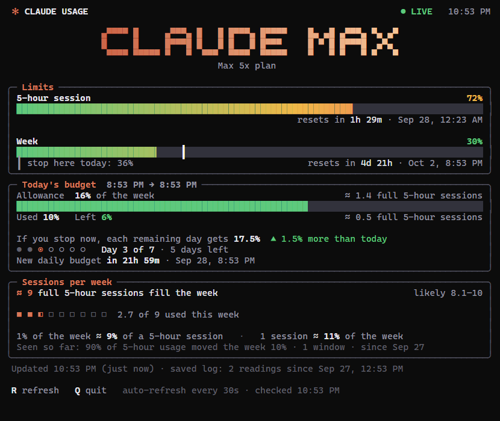

# Claude usage tracker

A terminal dashboard for your Claude plan limits. It answers two questions the
built-in meters don't:

- **How much can I use today?** It splits what's left of your weekly limit
  evenly over the days left until the weekly reset, and shows how much of
  today's share you've used, what's left, or how far over you are. Use less
  than your share and every later day gets more; go over and they get less.
- **How many 5-hour sessions fill a week?** It watches how far the weekly
  meter moves for every point the 5-hour meter moves, and turns that into
  "about 9 full 5-hour sessions use up the whole week" - with a range that
  narrows as more usage is seen.



*(Screenshot uses made-up numbers.)*

Plain Python standard library, no packages. Windows is the main target (the
R / Q keys use the Windows console); the rest works anywhere Python and
Claude Code run.

## How it works

Claude Code sends your plan-limit percentages to its status line after every
message. `statusline.js` is that status line: it shows cache stats in the
status bar and saves the numbers into your Claude folder (`~/.claude`):

| File | What's in it |
| --- | --- |
| `usage-latest.json` | The latest 5-hour and weekly percentages and reset times |
| `usage-history.jsonl` | One line every time either number changes - the permanent log |

`claude-usage.py` reads those two files and draws the dashboard, re-reading
every 30 seconds. It keeps nothing in memory, so closing it or rebooting loses
nothing. The numbers move when any Claude Code session sends a message; see
below for the desktop app and claude.ai.

### Desktop app and claude.ai

The status line is a terminal feature, so usage in the Claude desktop app or
on claude.ai doesn't send new numbers by itself. To cover that, whenever the
status line has been quiet for 2 minutes, the dashboard asks your Claude
account for the same two numbers directly - every 2 minutes, only while the
dashboard is open - and saves them to the same files (the footer then says
"from your account").

This uses the login key Claude Code saved in `~/.claude/.credentials.json`
and sends it only to Anthropic, the same way Claude Code's usage screen does.
The connection isn't documented by Anthropic and could change; if it stops
working, the dashboard says why and keeps using the status line. Run with
`--no-account` (or set `CLAUDE_USAGE_NO_ACCOUNT=1`) to turn it off.

The banner shows your plan (Pro, Max, Team, Enterprise...) by asking Claude
Code (`claude auth status`). The usage-limit size, such as "Max 5x", is read
from the plan fields of Claude Code's saved login.

### The daily budget

A "day" starts at the same clock time as your weekly reset, so the week is
always exactly 7 equal days. If your week resets Thursday 4:00 AM, every day
runs 4:00 AM to 4:00 AM.

Today's allowance = the weekly limit left when today began ÷ days left
(including today). It's fixed for the day. A fresh week starts at 100 ÷ 7 ≈
14.3% per day.

On the first day of tracking, usage from before the first saved reading can't
be attributed to today, so that day is marked **Partial day**.

### Sessions per week

The dashboard only compares readings taken inside the same 5-hour window and
the same week, so resets never throw the numbers off. The meters report whole
percentages, so each unbroken run of readings can be off by up to one point;
the "likely" range accounts for that and tightens as usage adds up. The
estimate appears once it has seen at least 25% of 5-hour usage and 3% of
weekly usage.

## Setup

1. Clone this repo.
2. Point Claude Code's status line at `statusline.js` in `~/.claude/settings.json`:

   ```json
   "statusLine": {
     "type": "command",
     "command": "node \"C:/path/to/claude-usage-tracker/statusline.js\""
   }
   ```

3. Send any message in Claude Code, then run `Claude Usage.bat` (or
   `python claude-usage.py`).

Keys: **R** re-read now, **Q** / **Esc** quit. `--once` prints one frame and exits.

If your Claude folder isn't `~/.claude`, set `CLAUDE_CONFIG_DIR` - both scripts
respect it.
